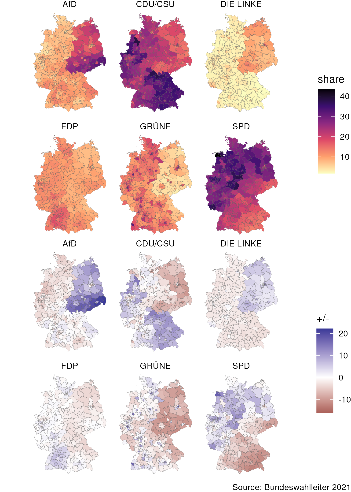

# German election 2021 ·  🇩🇪

**Source** — The Federal Returning Officer ("Der Bundeswahlleiter): Bundestag election 2021

- [results](https://www.bundeswahlleiter.de/en/bundestagswahlen/2021/ergebnisse.html) constituencies
  - © The Federal Returning Officer, Wiesbaden 2021
- [geometric data](https://www.bundeswahlleiter.de/en/bundestagswahlen/2021/wahlkreiseinteilung/downloads.html) of constituencies
  - © Der Bundeswahlleiter, Statistisches Bundesamt, Wiesbaden 2020, Wahlkreiskarte für die Wahl zum 20. Deutschen Bundestag Basis of the geological information © Geobasis-DE / BKG 2020

---

