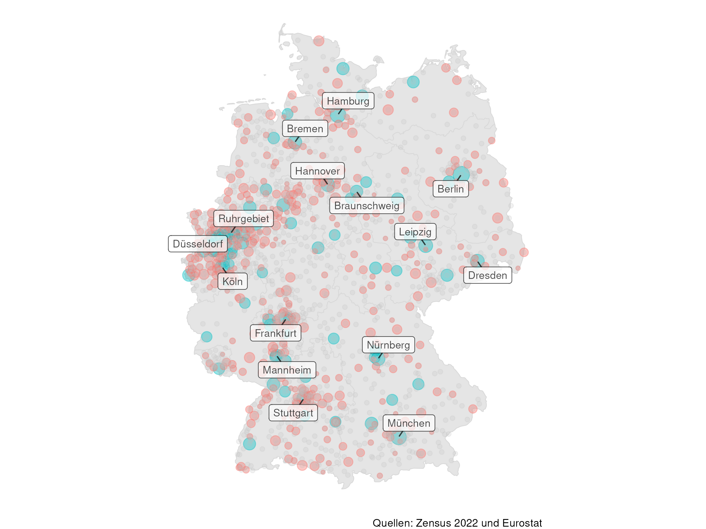

# Bevölkerung Deutschland · 🇩🇪

Übersicht zur Bevölkerung in Deutschland

- Städte und Gemeinden (Zensus 2022)
- Metropolregionen (Eurostat 2024)

Quellen

- Zensus 2022, Statistische Ämter des Bundes und der Länder, [dl-de/by-2-0](http://www.govdata.de/dl-de/by-2-0)
  - Personen: Bevölkerungszahl · [1000A-0000](https://ergebnisse.zensus2022.de/datenbank/online/statistic/1000A/table/1000A-0000)
- Eurostat, Europäische Kommission, [CC BY 4.0](https://creativecommons.org/licenses/by/4.0/)
  - DOI [10.2908/MET_PJANAGGR3](https://doi.org/10.2908/MET_PJANAGGR3)
- [Natural Earth](https://cran.r-project.org/web/packages/rnaturalearth/vignettes/rnaturalearth.html)
  and [OpenStreetMap](https://jessecambon.github.io/tidygeocoder/)

---

